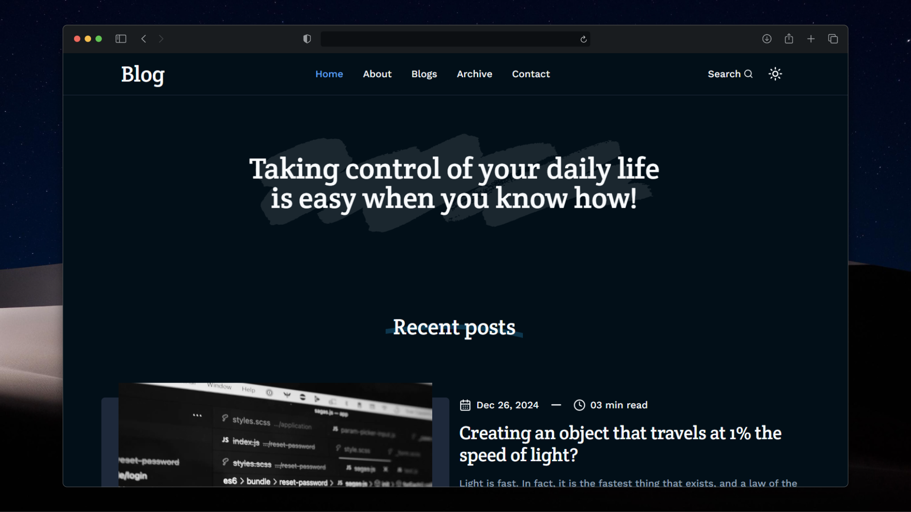
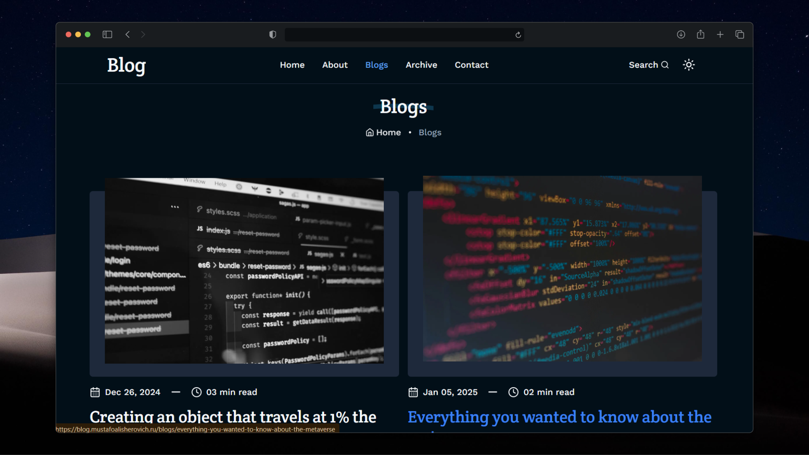
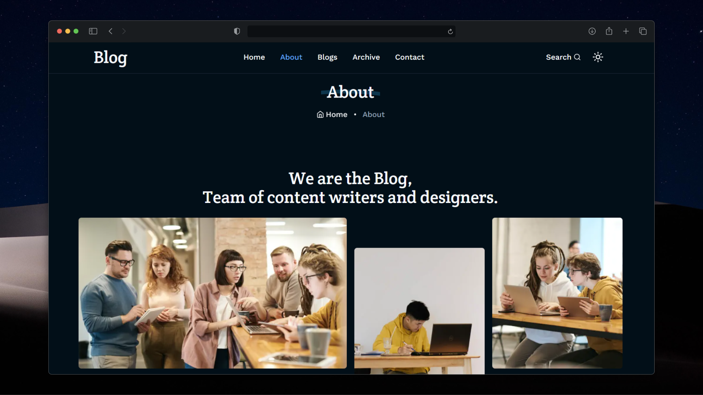

# 📝 Blog Platform  

[](https://nextjs.org/)  
[](https://www.typescriptlang.org/)  
[](https://ui.shadcn.com/)  
[](https://hygraph.com/)  

A modern and feature-rich blog platform built with **Next.js**, **TypeScript**, **shadcn/ui**, and **Hygraph CMS**.  
Designed for fast content publishing, advanced filtering, and an elegant reading experience.  

---

## 📸 Screenshots







---

## ✨ Features  

- 🔍 **GitHub-powered Search** — Quickly find blog posts, code snippets, or projects by author name or keyword.  
- 🏷 **Category & Tag Filtering** — Explore posts by category or tags.  
- 🌗 **Theme Toggle** — Switch between light and dark mode.  
- 📦 **Archive System** — Move older posts into an archive while keeping them accessible.  
- 👤 **Author Profiles** — Every post includes the author’s name and GitHub profile link.  

---

## 🛠 Tech Stack  

- ⚡ **Next.js** — Fast and scalable React framework.  
- 🟦 **TypeScript** — Strongly typed JavaScript for safer development.  
- 🎨 **shadcn/ui** — Modern and customizable UI components.  
- 📰 **Hygraph CMS** — Headless CMS for flexible content management.  

---

## 🚀 Getting Started  

```bash
# Clone the repository
git clone https://github.com/MustafoAlisherovich/blog.git

# Install dependencies
npm install

# Run the development server
npm run dev
